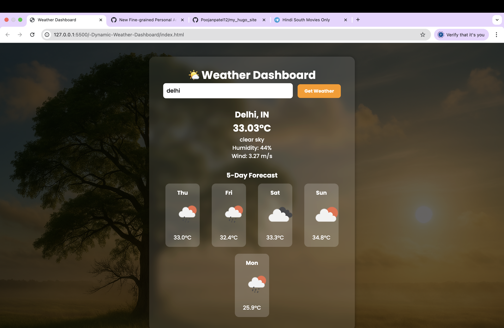

# 🌦️ Dynamic Weather Dashboard

A responsive and dynamic weather dashboard built using **HTML, CSS, and JavaScript**.  
The app fetches real-time weather data from the **OpenWeatherMap API** and displays temperature, humidity, wind speed, and a 5-day forecast with weather icons.  
It also includes geolocation support and recent search history via LocalStorage.

---

## 🚀 Live Demo
👉 [ cleak here to View Project]( https://poojanpatel12.github.io/-Dynamic-Weather-Dashboard/)

---

## 📸 Screenshots
### Homepage




---

## ✨ Features
- 🌡 Current temperature display  
- 💧 Humidity information  
- 🌬 Wind speed indicator  
- 🌤 Weather condition with dynamic icons  
- 📍 Geolocation support ("Use My Location(By Default)")  
- 📅 5-day weather forecast  
- 💾 LocalStorage for recent searches  
- 📱 Fully responsive design (Mobile + Desktop)  

---

## 🛠 Tech Stack
- **HTML5**  
- **CSS3**  
- **JavaScript (ES6)**  
- **OpenWeatherMap API**  
- **LocalStorage**

---

## ⚙️ Installation
1. Clone the repository:
   ```bash
   git clone https://github.com/USERNAME/dynamic-weather-dashboard.git
